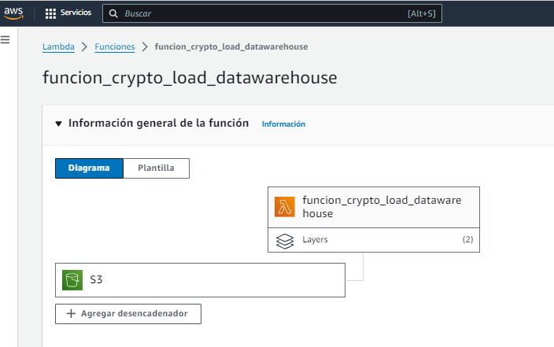

# Amazon AWS Cloud Lambda, S3 y RedShift. Data Engineer

# Introduccion
Proyecto con la infraestructura de nube de Amazon, Lambda para automatizar el ETL, S3 como storage y RedShift como BD. Utilizamos una API de cryptomonedas.
# Arquitectura
Tenemos tres componentes: API, Lambda, S3 y RedShift. 

Se ha diseñado dos funciones Lambda (tienen el codigo fuente en el repo):
- funcion_crypto_etl: permite automatizar el ETL, crea un CSV limpio y lo guarda en un S3 (Bucket storage). Ademas se ha usado algunas variables.

- funcion_crypto_load_datawarehouse: copia el CSV que se encuentre en un S3 Bucket a la BD RedShift. Se ha creado un Trigger, que se activa cuando se load un CSV en el S3 Bucket
  

# Contacto
Miguel Angel Ramos Cañari: mramos.pe@gmail.com

Celular: +51952351404

LinkedIn: https://www.linkedin.com/in/miguel-angel-ramos-canari/
